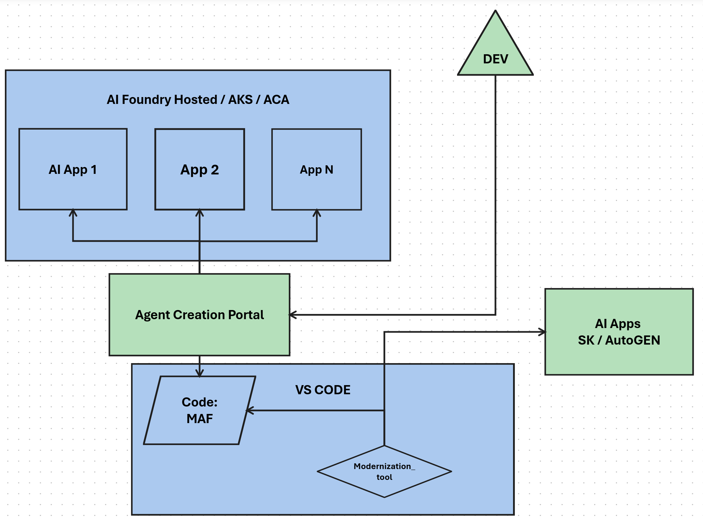

# 🏭 Agent Factory

Dynamically create AI agents using **Microsoft Agent Framework (MAF)** with **Azure AI Foundry**.

## 📋 Description

`agent_factory.py` is an agent factory that enables:

- ✅ Create custom agent configurations
- ✅ List existing agents in Azure AI Foundry
- ✅ List available MCP tools
- ✅ Create new agents in Azure AI Foundry with MCP tools
- ✅ Chat with agents using streaming

## 🚀 Installation

```bash
# Create virtual environment
python -m venv .venv
.venv\Scripts\activate  # Windows

# Install dependencies
pip install -r requirements.txt
```

## 🏛️ Architecture

The following diagram shows the solution architecture:

<p align="center">
  
</p>

**Main components:**
- **Agent Factory** - Orchestrates agent creation and management
- **Azure AI Foundry** - Hosting platform for agents and models
- **MCP Tools** - Tools connected via Model Context Protocol
- **FastAPI Portal** - Web interface to interact with agents

## ⚙️ Configuration

Create a `.env` file:

```env
AZURE_AI_PROJECT_ENDPOINT=https://<your-project>.services.ai.azure.com/api/projects/<name>
AZURE_AI_MODEL_DEPLOYMENT=gpt-4o
```

Authenticate with Azure CLI:
```bash
az login
```

## 📖 Usage

### Initialize the factory

```python
from agent_factory import AgentFactory

factory = AgentFactory(
    project_endpoint="https://...",
    model_deployment="gpt-4o"
)
```

### Create a local agent

```python
config = factory.create_agent_config(
    name="SalesAssistant",
    description="Helps with sales inquiries",
    purpose="Answer questions about products and pricing",
    personality="friendly and persuasive",
    capabilities=["Query catalog", "Calculate discounts"],
    rules=["Always offer alternatives", "Be honest about availability"]
)
```

### List agents from Azure AI Foundry

```python
agents = await factory.list_foundry_agents()
for agent in agents:
    print(f"{agent.name} - {agent.model}")
    if agent.has_tools:
        print(f"  Tools: {agent.tool_types}")
```

### List available MCP tools

```python
tools = await factory.list_foundry_tools()
for tool in tools:
    print(f"{tool.name}: {tool.target}")
```

### Create agent in Azure AI Foundry with MCP tools

```python
agent = await factory.create_foundry_agent(
    name="MyAgent",
    instructions="You are a helpful assistant...",
    model="gpt-4o",
    tool_names=["MicrosoftLearn5", "favorite-payment"]  # MCP connection names
)
print(f"Agent created: {agent.id}")
```

### Chat with an agent

```python
async for chunk in factory.chat_with_foundry_agent(agent_id, "Hello!"):
    print(chunk, end="", flush=True)
```

## 🏗️ Structure

```
AgentFactory
├── create_agent_config()      # Create local config
├── get_agent_config()         # Get config by ID
├── list_agents()              # List local configs
├── list_foundry_agents()      # List Foundry agents
├── list_foundry_tools()       # List MCP tools
├── create_foundry_agent()     # Create agent in Foundry
├── chat_with_foundry_agent()  # Chat with Foundry agent
└── chat_with_agent()          # Chat with local agent
```

## 📦 Dependencies

| Package | Version |
|---------|---------|
| `agent-framework` | 1.0.0b260210 |
| `agent-framework-azure-ai` | 1.0.0b260210 |
| `azure-ai-projects` | >=2.0.0b2 |
| `azure-identity` | latest |

## 🌐 Web Portal

Run `app.py` for a web interface:

```bash
uvicorn app:app --reload --port 8000
```

Open http://localhost:8000 to create and chat with agents visually.
